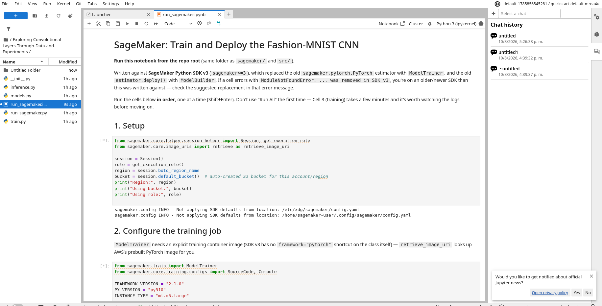

# Exploring Convolutional Layers Through Data and Experiments

Course assignment: convolutional layers analyzed as an architectural choice — not a recipe —
through EDA, a non-convolutional baseline, a from-scratch CNN design, and a controlled
experiment on one architectural knob.

The full walkthrough (code, plots, discussion) lives in
[`notebooks/exploring_convolutional_layers.ipynb`](notebooks/exploring_convolutional_layers.ipynb).
This README summarizes the same content as a written report.

## Problem Description

Design and analyze convolutional neural network architectures on a real image dataset,
justifying every structural decision (depth, kernel size, stride, padding, pooling) rather
than copying a known architecture, and compare the result against a non-convolutional
baseline to make the value of convolution's inductive bias measurable rather than assumed.

## Dataset

**[Fashion-MNIST](https://github.com/zalandoresearch/fashion-mnist)** (Zalando Research),
loaded via `torchvision.datasets.FashionMNIST`.

| Property | Value |
|---|---|
| Image size | 28x28, 1 channel (grayscale) |
| Classes | 10 (clothing categories) |
| Train / test split | 60,000 / 10,000, class-balanced |
| Size on disk | ~30 MB |

**Why this dataset fits a convolution study:** it is real photographic image data (not
synthetic shapes) with genuine local structure — edges, textures, silhouettes — that can
appear anywhere within a garment's bounding box. That "same local pattern, variable position"
property is exactly what convolution's weight sharing and translation equivariance are built
to exploit, and Fashion-MNIST was explicitly created because plain MNIST digits are too
simple to separate architectures on. It is also small enough to iterate on CPU while keeping
the focus on architecture rather than data-engineering (no streaming, no resizing needed —
every image is already a uniform 28x28x1).

Preprocessing: `ToTensor()` (scale to `[0, 1]`) + per-dataset mean/std normalization. No
resizing or color handling is needed (uniform size, single channel already).

## Architecture

### Baseline (non-convolutional)

```
Input (1x28x28)
  -> Flatten                    [784]
  -> Dense(784 -> 256) -> ReLU
  -> Dense(256 -> 128) -> ReLU
  -> Dense(128 -> 10)
```

Exists purely as a reference point: a model structurally incapable of using locality or
translation invariance, since spatial structure is discarded at the very first layer.

### CNN (designed from scratch)

```
Input (1x28x28)
  -> Conv2d(1->16, k=3x3, stride=1, padding=1) -> ReLU -> MaxPool2d(2x2)   [16 x 14x14]
  -> Conv2d(16->32, k=3x3, stride=1, padding=1) -> ReLU -> MaxPool2d(2x2)  [32 x 7x7]
  -> Flatten                                                              [1568]
  -> Dense(1568 -> 128) -> ReLU -> Dropout(0.3)
  -> Dense(128 -> 10)
```

| Choice | Value | Why |
|---|---|---|
| Conv layers | 2 | Two natural structure levels at 28x28 resolution: edges/strokes, then parts/textures (collars, straps, soles). A third conv layer would run on a <=3x3 feature map — too little spatial extent left to justify the added parameters. |
| Kernel size | 3x3 | Two stacked 3x3 convs reach a 5x5 effective receptive field with fewer parameters and an extra nonlinearity versus one 5x5 conv — more expressive per parameter. Studied explicitly as the controlled variable (see below). |
| Stride | 1 in conv, 2 in pooling | Conv stride 1 keeps every layer looking at full resolution; downsampling is delegated entirely to pooling so resolution loss is explicit, not implicit in the conv. |
| Padding | 1 (`'same'` for 3x3) | Without it, a 3x3 conv shrinks the map by 2px/side and systematically under-weights border pixels (fewer conv windows touch them). `'same'` padding keeps garment edges near the image border equally represented. |
| Activation | ReLU | Cheap, avoids saturation-driven vanishing gradients at this depth. |
| Pooling | MaxPool 2x2 per block | Local translation invariance + 4x spatial reduction per block, which keeps the flattened feature count (and dense-head parameter count) manageable. |
| Regularization | Dropout(0.3) before the last Dense layer | Most parameters live in the dense head (`1568 -> 128 -> 10`); dropout targets overfitting where it's most likely, without penalizing the lighter conv blocks. |

Small and shallow on purpose — the assignment is about reasoning under a fixed, modest
budget, not chasing accuracy with unjustified depth.

## Experimental Results

Exact numbers are produced by running the notebook (`results/*.csv` and `reports/figures/*.png`
are regenerated on each run) — the tables/figures below are the ones committed from the last
executed run.

### Baseline vs. CNN

| Model | Parameters | Test accuracy | Test loss |
|---|---|---|---|
| Baseline MLP | 235,146 | 88.10% | 0.338 |
| CNN (3x3) | 206,922 | 90.17% | 0.276 |

(from `results/baseline_vs_cnn.csv`, 8 epochs each, same seed/split). The CNN reaches ~2.1
points higher test accuracy than the baseline while using fewer trainable parameters, and
its confusion matrix (`reports/figures/cnn_confusion_matrix.png` vs
`baseline_confusion_matrix.png`) shows markedly less confusion among the visually similar
upper-body classes (T-shirt/top, Shirt, Pullover, Coat).

### Controlled experiment: kernel size (3x3 vs 5x5 vs 7x7)

Everything except kernel size is held fixed (depth, filter counts, stride, `padding =
kernel_size // 2` so spatial size is preserved before pooling, activation, pooling, dropout,
optimizer, epochs, data split/seed).

| Kernel | Parameters | Train time | Test accuracy |
|---|---|---|---|
| 3x3 | 206,922 | 119.3s | 90.07% |
| 5x5 | 215,370 | 125.3s | **90.92%** |
| 7x7 | 228,042 | 139.9s | 90.55% |

(from `results/kernel_size_experiment.csv`; curves/bars in `reports/figures/kernel_size_curves.png`
and `kernel_size_tradeoffs.png`.)

**Trade-off:** parameters and training time grow **monotonically** with kernel size, as
expected (`(k/3)^2` more weights per filter). Test accuracy does **not** — 5x5 edges out both
3x3 and 7x7 in this single-seed run, and all three sit within ~1 percentage point of each
other, which is small enough to plausibly be run-to-run noise rather than a systematic effect.
The honest conclusion is that kernel size did not reliably move accuracy here, while it did
reliably move cost — combined with the standard argument that two stacked 3x3 convolutions
reach the same effective receptive field as one 5x5 with fewer parameters, that makes **3x3
the sensible default** for this problem size: not because it measurably won, but because
larger kernels bought no dependable accuracy advantage for their added cost.

## Interpretation

**Why did convolution outperform (or not) the baseline?** The CNN's weight sharing lets one
learned filter (e.g. a diagonal-edge detector) apply at every spatial position, so it doesn't
need to relearn the same pattern separately for every pixel offset the way the baseline's
fully-connected first layer does. That's why it reaches higher accuracy with fewer parameters
and confuses visually-similar classes less often — it represents "has this edge/texture
pattern" rather than "these specific pixels are bright."

**What inductive bias does convolution introduce?** Two combined priors: **locality** (a
unit's output depends only on a small spatial neighborhood) and translation equivariance
via weight sharing (the same filter is applied identically at every position, becoming
approximate translation invariance once pooling is added). Both assume the data has local,
position-independent structure — true for natural images, not a given elsewhere.

**When is convolution not appropriate?** When data lacks that local/spatial structure:
unordered tabular features (no meaningful "neighboring column" for a kernel to slide over),
data where the same value means something different depending on its fixed position (weight
sharing actively fights learning position-specific meaning), or long-range/irregular
structure like language or graphs, where architectures matching that structure (attention,
graph networks) fit the inductive bias better than a fixed spatial grid does.

Full-length reasoning: see Section 6 of the notebook.

## Repository Structure

```
├── README.md
├── requirements.txt
├── notebooks/
│   └── exploring_convolutional_layers.ipynb   # main deliverable
├── src/
│   ├── data.py      # dataset loading, transforms, dataloaders
│   ├── models.py    # BaselineMLP, configurable SimpleCNN
│   └── train.py      # shared train/eval loop
├── sagemaker/
│   ├── train.py               # SageMaker training entry point (reuses src/)
│   ├── inference.py           # SageMaker endpoint handler
│   ├── run_sagemaker.ipynb    # open this directly in Studio: fit -> deploy -> test -> delete
│   └── run_sagemaker.py       # same content, plain-script form (for review/diffing)
├── reports/figures/  # plots generated by the notebook
└── results/          # CSV metrics generated by the notebook
```

## Reproducing

```bash
python -m venv .venv && source .venv/bin/activate
pip install -r requirements.txt
jupyter nbconvert --to notebook --execute --inplace notebooks/exploring_convolutional_layers.ipynb
```

## Task 6: SageMaker Training and Deployment

The project was trained and deployed on **Amazon SageMaker (AWS)**, running successfully
end-to-end.



